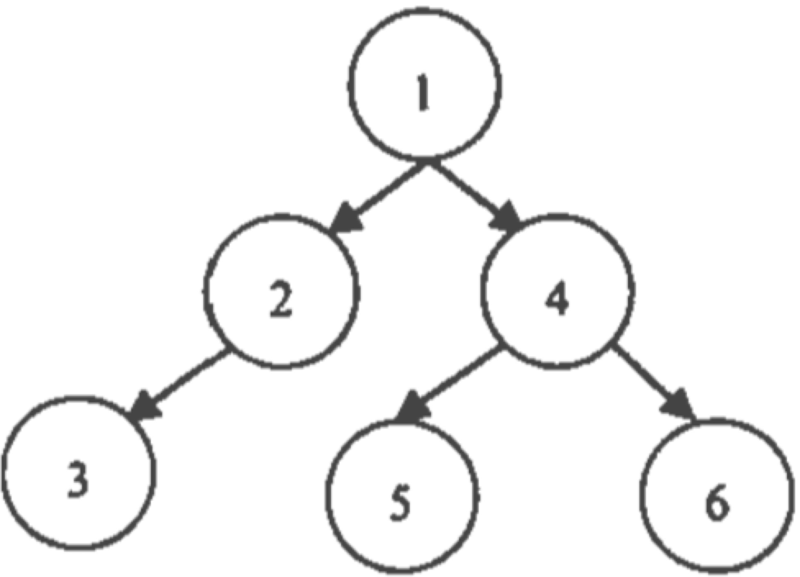
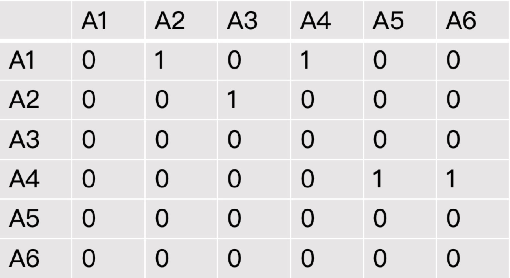
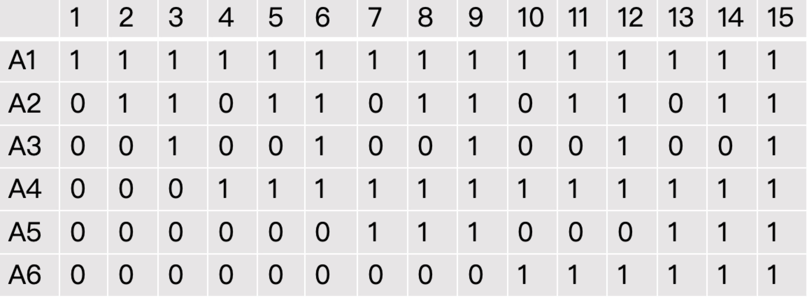
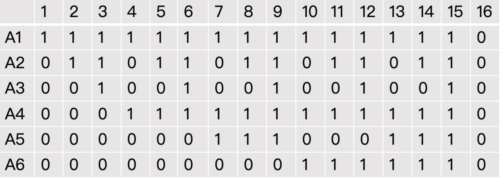
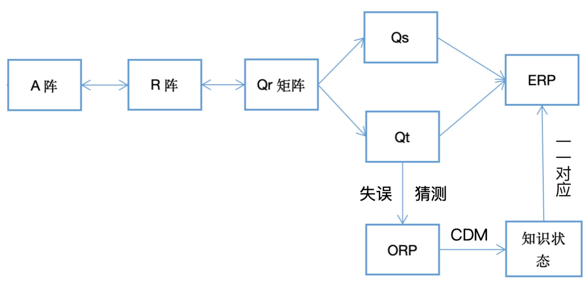

Q矩阵理论
=================

Q矩阵理论的先驱是Tatsuoka教授，她认为 :math:`Q` 矩阵理论欲确定学生不可观察的知识状态，并且运用可以直接观察得到的反应模式（ :math:`ORP` ）表示这些知识状态。

学生的知识状态由属性向量表征，属性表示测验项目的特征（知识点），是学生正确解决特定项目所需要的认知加工能力和技能。

一个完整的 :math:`Q` 矩阵理论包括：属性层级结构（ :math:`AHS` ）、邻接矩阵（ :math:`A` ）、可达矩阵（ :math:`R` ）、缩减矩阵（ :math:`Qr` ）、学生 :math:`Q` 矩阵（ :math:`Qs` ）、测验 :math:`Q` 矩阵（ :math:`Qt` ）和期望反应模式（ :math:`ERP` ）。

通过一个具体例子对Q矩阵理论进行详细阐述：
首先，假定某份认知诊断测验（可以理解为测验试卷）的属性层级结构( :math:`AHS`)如下图

图中可知，这份测验包含 :math:`6` 个属性（ **知识点** ），属性之间存在层级关系。例如，属性 :math:`1` 是属性 :math:`2` 和属性 :math:`4` 的先决关系，即掌握属性 :math:`2` 之前必须先掌握属性 :math:`1` 。这种层级关系是必须的，例如掌握加法之前必须先掌握乘法。

根据上图的知识点层级关系，可以得到邻接矩阵 :math:`A` 阵，描述知识点之间的直接关系（“ :math:`1` ”表示存在关系，“ :math:`0` ”表示不存在关系）。如下表：

由 :math:`A` 阵与同阶单位阵的和 :math:`A+I` ，通过Warshall算法可以得到可达矩阵 :math:`R` 阵， :math:`R` 阵描述属性间直接、间接以及和自身关系的矩阵（“ :math:`1` ”表示存在关系，“ :math:`0` ”表示不存在关系）。如下表：

在得到 :math:`R` 阵之后，可以通过删除法或者扩张算法导出所有可能的项目类别，即在上述属性（知识点）层级结构之下，一份测验可以编制出来的所有题目类型，记做缩减矩阵 :math:`Qr` 阵， **行代表属性，列代表项目类** （“ :math:`1` ”表示项目考察了属性，“ :math:`0` ”表示没有考察，例如表中的项目类型 :math:`3` 考察了属性 :math:`A1` 、 :math:`A2` 、 :math:`A3` ）。本例中最多只能确定 :math:`15` 种题目类型, :math:`Qr` 矩阵如下：

将缩减矩阵加上一列全为“ :math:`0` ”的向量，就得到了所有可能的知识状态（ :math:`ks` ）集合，也就是学生类型，记做 :math:`Qs` 。 :math:`Qs` **矩阵行表示属性，列代表学生类型** （“ :math:`1` ”表示该类学生掌握了对应属性，“ :math:`0` ”该类学生没有掌握对应属性，例如类型 :math:`3` 的学生掌握了属性 :math:`A1` 、 :math:`A2` 、 :math:`A3` ）全为“ :math:`0` ”的列表示该类学生没有掌握任何属性，所以共有 :math:`16` 种知识状态集合。

**测验矩阵 :math:`Qt` 的编制** ，
*** :math:`Qt` 矩阵中的列是 :math:`Qr` 阵的列自由组合得到*** ， **测验矩阵 :math:`Qt` 的作用指导编制测验题目，也就是测验试卷**

首先要搞明白有了缩减矩阵 :math:`Qr` 为什么还要 :math:`Qt` 。有的考试知识点比较多，层级关系也比较分散，这就会造成 :math:`Qr` 种类非常多，一个极端的例子，比如一份试卷包含 :math:`16` 个互相独立的属性，那么 :math:`Qr` 的种类有 :math:`2^{16}` 种，而一份试卷不可能包含这么多种类的题目，所以 :math:`Qt` 是 :math:`Qr` 的一个子集，但是 :math:`Qt` 的编制需要满足包含至少一个 :math:`R` 阵，这样才能保证知识状态（ :math:`ks` ）与 :math:`ERP` 一一对应。《认知诊断测验蓝图的设计，丁树良》

期望反应模式（ :math:`ERP` ）指学生在不存在任何失误和猜测的情况下对题目的作答反应模式，即学生掌握了题目考察的属性就能答对该题，只要一个属性未掌握就答不对该题。但在现实中，学生在作答时或多或少都会存在一些失误和猜测，因此，期望反应模式是一种理想化的反应模式。

期望反应模式（ :math:`ERP` ）的计算：将 :math:`Qs` 矩阵中的列（ :math:`Qs` 中每一列代表一类“期望被试”的知识状态）与测验矩阵 :math:`Qt` 中的列（ :math:`Qt` 中每一列表示一个测验题目包含的知识属性）做向量减法，如果成“包含”关系，即所得结果中没有出现 :math:`-1` ，记为 :math:`1` ，否则为 :math:`0`
所以得到的某个“期望被试”的期望反应模式是一个长度为 :math:`Qt` 项目数的 :math:`01` 向量
\*“期望被试”指的是 :math:`Qs` 中某一知识状态类型的被试

将上述概念串联起来： 1.
首先确定属性的范围和层级关系（ :math:`AHS` ），即确实知识点结构树 2.
计算邻接矩阵 :math:`A` 阵，反应了属性间的直接关系 3.
根据 :math:`A` 阵计算 :math:`R` 阵，反应属性间直接、间接及自身的关系
4.
根据 :math:`R` 阵通过扩张法（推荐）或缩减法计算缩减矩阵 :math:`Qr` ，表示所有的项目类型
5.
将 :math:`Qr` 加上全为 :math:`0` 的一列，得到学生的知识状态矩阵 :math:`Qs` ，表示学生所有可能的知识状态
6. 编制测验矩阵 :math:`Qt` ，作为测验试卷的蓝图 7.
由 :math:`Qs` 和 :math:`Qt` ，计算出与 :math:`Qs` 一一对应的 :math:`ERP`

之后根据测验矩阵 :math:`Qt` 编制真实的测试试卷，得到学生真实的作答反应（ :math:`ORP` ）。将真实的作答数据通过认知诊断模型（ :math:`CDM` ）分类到与之对应的期望反应模式中。
\*这里的分类只对应一部分的认知诊断模型，有的 :math:`CDM` 是将知识状态作为代估计的参数。